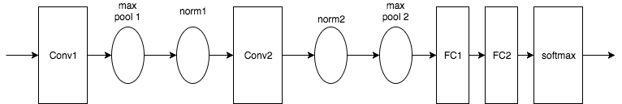

# Deep Classification

## Overview
------
The project is related to object classification, which we'll implement a classifier on cifar-10 dataset using some deep learning skills.


```python
import time
import os
import sys
from six.moves import urllib
import tarfile
import tensorflow as tf
import numpy as np
import warnings
warnings.filterwarnings("ignore")
```

## Implementation
------
### 0. Hardware/Software Environment
CPU : i7-8700K <br />
RAM : 32GB <br />
GPU : GTX-1080Ti <br />
OS  : Windows / Arch-Linux <br />
Building with Tensorflow-GPU version 1.4.0. <br />
### 1. Data Loading
I implemented a function that auto download and extract the dataset using *urllib.request.urlretrieve()*, before downloading it auto detects whether the dataset is already exist.


```python
def maybe_download_and_extract(dest_directory, url):
    if not os.path.exists(dest_directory):
        os.makedirs(dest_directory)
    file_name = 'cifar-10-binary.tar.gz'
    file_path = os.path.join(dest_directory, file_name)
    # if have not downloaded yet
    if not os.path.exists(file_path):
        def _progress(count, block_size, total_size):
            sys.stdout.write('\r%.1f%%' % (float(count * block_size) / float(total_size) * 100.0))
            sys.stdout.flush() # flush the buffer
        print('>> Downloading %s ...' % file_name)
        file_path, _ = urllib.request.urlretrieve(url, file_path, _progress)
        file_size = os.stat(file_path).st_size
        print('\r>> Total %d bytes' % file_size)
    extracted_dir_path = os.path.join(dest_directory, 'cifar-10-batches-bin')
    if not os.path.exists(extracted_dir_path):
        # Open for reading with gzip compression, then extract all
        tarfile.open(file_path, 'r:gz').extractall(dest_directory)
    print('>> Done')
```

So now we can simply put the link into the function:


```python
DATA_URL = 'http://www.cs.toronto.edu/~kriz/cifar-10-binary.tar.gz'
DEST_DIRECTORY = 'dataset/cifar10'
DATA_DIRECTORY = DEST_DIRECTORY + '/cifar-10-batches-bin'

maybe_download_and_extract(DEST_DIRECTORY, DATA_URL)
```

    >> Done
    

### 2. Convolutional Neural Network Model
My model is based on the following graph :
<center></center> 
And we have some more detail specs : <br />
1. All variables are processed in CPU because we want GPU to only focus on calculation. <br />
2. Our cost function is *cross entropy* of labels and predictions.  <br />
3. We use *Weight decay* as our regularization method. The implementation of weight decay is to add a term in the cost function that penalizes the L2-norm of the weight matrix at each layer. (see *_variable_with_weight_decay()* function) <br />
4. The activation function we used in our CNN model is *ReLU*, whose output has no upper bound, which we need a local response normalization to normalize that. The method we use is *Local response normalization*. <br />
5. When using gradient descent to update the weights of a neural network, sometimes the weights might move in the wrong direction. Thus, we take a moving average of the weights over a bunch of previous updates. <br />


```python
class CNN_Model(object):
    def __init__(self, batch_size, 
                 num_classes, 
                 num_training_example, 
                 num_epoch_per_decay,
                 init_lr,
                 moving_average_decay):
        self.batch_size = batch_size
        self.num_classes = num_classes
        self.num_training_example = num_training_example
        self.num_epoch_per_decay = num_epoch_per_decay
        self.init_lr = init_lr
        self.moving_average_decay = moving_average_decay
    
    def _variable_on_cpu(self, name, shape, initializer):
        with tf.device('/cpu:0'):
            var = tf.get_variable(name, shape, initializer=initializer, dtype=tf.float32)
        return var
    
    def _variable_with_weight_decay(self, name, shape, stddev, wd=0.0):
        """Helper to create an initialized Variable with weight decay.
        Note that the Variable is initialized with a truncated normal distribution.
        A weight decay is added only if one is specified.
        Args:
            name: name of the variable
            shape: list of ints
            stddev: standard deviation of a truncated Gaussian
            wd: add L2Loss weight decay multiplied by this float. If None, weight
                decay is not added for this Variable.
        Returns:
            Variable Tensor
        """
        initializer = tf.truncated_normal_initializer(stddev=stddev, dtype=tf.float32)
        var = self._variable_on_cpu(name, shape, initializer)
        # deal with weight decay
        weight_decay = tf.multiply(tf.nn.l2_loss(var), wd, name='weight_loss')
        tf.add_to_collection('losses', weight_decay)
        return var
    
    def inference(self, images):
        """build the model
        Args:
            images with shape [batch_size,24,24,3]
        Return:
            logits with shape [batch_size,10]
        """
        with tf.variable_scope('conv_1') as scope:
            kernel = self._variable_with_weight_decay('weights', [5,5,3,64], 5e-2)
            conv = tf.nn.conv2d(images, kernel, strides=[1,1,1,1], padding="SAME")
            biases = self._variable_on_cpu('bias', [64], tf.constant_initializer(0.0))
            pre_activation = tf.nn.bias_add(conv, biases)
            conv_1 = tf.nn.relu(pre_activation, name=scope.name)
        # pool_1
        pool_1 = tf.nn.max_pool(conv_1, ksize=[1,3,3,1], strides=[1,2,2,1], 
                                padding='SAME', name='pool_1') 
        # norm_1 (local_response_normalization)
        norm_1 = tf.nn.lrn(pool_1, 4, bias=1.0, alpha=0.001/9.0, beta=0.75, name='norm_1')
        # conv2
        with tf.variable_scope('conv_2') as scope:
            kernel = self._variable_with_weight_decay('weights', [5, 5, 64, 64], 5e-2)
            conv = tf.nn.conv2d(norm_1, kernel, [1, 1, 1, 1], padding='SAME')
            biases = self._variable_on_cpu('biases', [64], tf.constant_initializer(0.1))
            pre_activation = tf.nn.bias_add(conv, biases)
            conv_2 = tf.nn.relu(pre_activation, name=scope.name)
        # norm2
        norm_2 = tf.nn.lrn(conv_2, 4, bias=1.0, alpha=0.001/9.0, beta=0.75, name='norm_2')
        # pool2
        pool_2 = tf.nn.max_pool(norm_2, ksize=[1, 3, 3, 1], strides=[1, 2, 2, 1], 
                               padding='SAME', name='pool_2')
        # FC_1 (fully-connected layer)
        with tf.variable_scope('FC_1') as scope:
            flat_features = tf.reshape(pool_2, [self.batch_size, -1])
            dim = flat_features.get_shape()[1].value
            weights = self._variable_with_weight_decay('weights', [dim, 384], 0.04, 0.004)
            biases = self._variable_on_cpu('biases', [384], tf.constant_initializer(0.1))
            FC_1 = tf.nn.relu(tf.matmul(flat_features, weights) + biases, name=scope.name)
        # FC_2
        with tf.variable_scope('FC_2') as scope:
            weights = self._variable_with_weight_decay('weights', [384, 192], 0.04, 0.004)
            biases = self._variable_on_cpu('biases', [192], tf.constant_initializer(0.1))
            FC_2 = tf.nn.relu(tf.matmul(FC_1, weights) + biases, name=scope.name)
        with tf.variable_scope('softmax_linear') as scope:
            weights = self._variable_with_weight_decay('weights', [192, self.num_classes],1/192.0)
            biases = self._variable_on_cpu('biases', [self.num_classes], tf.constant_initializer(0.0))
            logits = tf.add(tf.matmul(FC_2, weights), biases, name=scope.name)
        return logits

    def loss(self, logits, labels):
        labels = tf.cast(labels, tf.int64)
        cross_entropy = tf.nn.sparse_softmax_cross_entropy_with_logits(
                        labels=labels, logits=logits, name='cross_entropy_per_example')
        cross_entropy_mean = tf.reduce_mean(cross_entropy, name='cross_entropy')
        tf.add_to_collection('losses', cross_entropy_mean)
        # The total loss is defined as the cross entropy loss plus all of the weight
        # decay terms (L2 loss).
        return tf.add_n(tf.get_collection('losses'), name='total_loss')
    
    def train(self, total_loss, global_step):
        num_batches_per_epoch = self.num_training_example / self.batch_size
        decay_steps = int(num_batches_per_epoch * self.num_epoch_per_decay)
        # Decay the learning rate exponentially based on the number of steps.
        lr = tf.train.exponential_decay(self.init_lr, global_step, decay_steps, 
                                        decay_rate=0.1, staircase=True)
        opt = tf.train.GradientDescentOptimizer(lr)
        grads = opt.compute_gradients(total_loss)
        apply_gradient_op = opt.apply_gradients(grads, global_step=global_step)
        # Track the moving averages of all trainable variables.
        # This step just records the moving average weights but not uses them
        ema = tf.train.ExponentialMovingAverage(self.moving_average_decay, global_step)
        self.ema = ema
        variables_averages_op = ema.apply(tf.trainable_variables())
        with tf.control_dependencies([apply_gradient_op, variables_averages_op]):
            train_op = tf.no_op(name='train')
        return train_op
```

### 3. Parser and iterator
We create some parser functions to transform the image into cropped size (and distorted), and an iterator which extract elements from the dataset.


```python
from tensorflow.contrib.data import FixedLengthRecordDataset, Iterator

def cifar10_record_distort_parser(record):
    ''' Parse the record into label, cropped and distorted image
    -----
    Args:
        record: 
            a record containing label and image.
    Returns:
        label: 
            the label in the record.
        image: 
            the cropped and distorted image in the record.
  '''
    record_bytes = LABEL_BYTES + IMAGE_BYTES
    record = tf.decode_raw(record, tf.uint8)
    label  = tf.cast(record[0], tf.int32)
    
    image = tf.reshape(record[1:record_bytes]
                       , [IMAGE_DEPTH, IMAGE_HEIGHT, IMAGE_WIDTH])
    
    reshaped_image = tf.cast(tf.transpose(image, [1, 2, 0]), tf.float32)
    distorted_image = tf.random_crop(reshaped_image
                                     , [IMAGE_SIZE_CROPPED, IMAGE_SIZE_CROPPED, 3])
    distorted_image = tf.image.random_flip_left_right(distorted_image)
    distorted_image = tf.image.random_brightness(distorted_image, max_delta=63)
    distorted_image = tf.image.per_image_standardization(distorted_image)
    
    return label, distorted_image
    

def cifar10_record_crop_parser(record):
    ''' Parse the record into label, cropped image
    -----
    Args:
        record: 
            a record containing label and image.
    Returns:
        label: 
            the label in the record.
        image: 
            the cropped image in the record.
  '''
    record_bytes = LABEL_BYTES + IMAGE_BYTES
    record = tf.decode_raw(record, tf.uint8)
    label  = tf.cast(record[0], tf.int32)
    
    image = tf.reshape(record[1:record_bytes]
                       , [IMAGE_DEPTH, IMAGE_HEIGHT, IMAGE_WIDTH])
    
    reshaped_image = tf.cast(tf.transpose(image, [1, 2, 0]), tf.float32)
    cropped_image = tf.random_crop(reshaped_image
                                     , [IMAGE_SIZE_CROPPED, IMAGE_SIZE_CROPPED, 3])
    cropped_image = tf.image.per_image_standardization(cropped_image)
    
    return label, cropped_image


def cifar10_iterator(filenames, batch_size, cifar10_record_parser):
    ''' Create a dataset and return a tf.contrib.data.Iterator 
    which provides a way to extract elements from this dataset.
    -----
    Args:
        filenames: 
            a tensor of filenames.
        batch_size: 
            batch size.
    Returns:
        iterator: 
            an Iterator providing a way to extract elements from the created dataset.
        output_types: 
            the output types of the created dataset.
        output_shapes: 
            the output shapes of the created dataset.
    '''
    record_bytes = LABEL_BYTES + IMAGE_BYTES
    dataset = FixedLengthRecordDataset(filenames, record_bytes)
    dataset = dataset.map(cifar10_record_parser)
    dataset = dataset.batch(batch_size)
    dataset = dataset.repeat(10)
    
    iterator = dataset.make_initializable_iterator()
    

    return iterator, dataset.output_types, dataset.output_shapes
```

### 4. Hyperparameters
The following block gathers up all the parameters to be set, we set the batch size to 100, crop image size to 24.


```python
IMAGE_HEIGHT = 32
IMAGE_WIDTH = 32
IMAGE_DEPTH = 3
IMAGE_SIZE_CROPPED = 24
BATCH_SIZE = 100
NUM_CLASSES = 10 
LABEL_BYTES = 1
IMAGE_BYTES = 32 * 32 * 3
NUM_EXAMPLES_PER_EPOCH_FOR_TRAIN = 50000
NUM_EXAMPLES_PER_EPOCH_FOR_EVAL = 10000
```

### 5. Pre-processing
Using the above functions and models, we setup a training process and its variables, and the training is about to begin.


```python
tf.reset_default_graph()

training_files = [os.path.join(DATA_DIRECTORY, 'data_batch_%d.bin' % i) for i in range(1, 6)]
testing_files = [os.path.join(DATA_DIRECTORY, 'test_batch.bin')]

filenames_train = tf.constant(training_files)
filenames_test = tf.constant(testing_files)

iterator_train, types, shapes = cifar10_iterator(filenames_train, BATCH_SIZE, cifar10_record_distort_parser)
iterator_test, _, _ = cifar10_iterator(filenames_test, BATCH_SIZE, cifar10_record_crop_parser)

next_batch = iterator_train.get_next()

# use to handle training and testing
handle = tf.placeholder(tf.string, shape=[])
iterator = Iterator.from_string_handle(handle, types, shapes)
labels_images_pairs = iterator.get_next()


# CNN model
model = CNN_Model(
    batch_size=BATCH_SIZE,
    num_classes=NUM_CLASSES,
    num_training_example=NUM_EXAMPLES_PER_EPOCH_FOR_TRAIN,
    num_epoch_per_decay=350.0,
    init_lr=0.1,
    moving_average_decay=0.9999)

with tf.device('/cpu:0'):
    labels, images = labels_images_pairs
    labels = tf.reshape(labels, [BATCH_SIZE])
    images = tf.reshape(images, [BATCH_SIZE, IMAGE_SIZE_CROPPED, IMAGE_SIZE_CROPPED, IMAGE_DEPTH])
with tf.variable_scope('model'):
    logits = model.inference(images)

# train
global_step = tf.contrib.framework.get_or_create_global_step()
total_loss = model.loss(logits, labels)
train_op = model.train(total_loss, global_step)
# test
top_k_op = tf.nn.in_top_k(logits, labels, 1)
```

### 6. Training
We train the model for 100 epochs, and print out loss per epoch to see the learning status. When the training process is complete, we store the current model for further usage.


```python
NUM_EPOCH = 100
NUM_BATCH_PER_EPOCH = NUM_EXAMPLES_PER_EPOCH_FOR_TRAIN // BATCH_SIZE
ckpt_dir = './model/'


# train
saver = tf.train.Saver()

with tf.Session() as sess:
    ckpt = tf.train.get_checkpoint_state(ckpt_dir)
    
    if (ckpt and ckpt.model_checkpoint_path):
        saver.restore(sess, ckpt.model_checkpoint_path)
        # assume the name of checkpoint is like '.../model.ckpt-1000'
        gs = int(ckpt.model_checkpoint_path.split('/')[-1].split('-')[-1])
        sess.run(tf.assign(global_step, gs))
    else:
        # no checkpoint found
        init_op = tf.group(tf.global_variables_initializer(), tf.local_variables_initializer())
        sess.run(init_op)
        
        
    coord = tf.train.Coordinator()
    threads = tf.train.start_queue_runners(sess=sess, coord=coord)
    loss = []
    print('======== Start Training ========')
    t0 = time.time()
    for i in range(NUM_EPOCH):
        _loss = [] 
        sess.run(iterator_train.initializer)
        t1 = time.time()
        for _ in range(NUM_BATCH_PER_EPOCH):
            lbl, img = sess.run(next_batch)
            l, _ = sess.run([total_loss, train_op], feed_dict={images: img, labels: lbl})
            _loss.append(l)
        loss_this_epoch = np.sum(_loss)
        gs = global_step.eval()
        t2 = time.time()
        print(f'Epoch {int(gs/NUM_BATCH_PER_EPOCH)} : Loss = {loss_this_epoch:.5f}, Epoch Time = {t2-t1:.2f}s')
        loss.append(loss_this_epoch)
        saver.save(sess, ckpt_dir + 'model.ckpt', global_step=gs)
    coord.request_stop()
    coord.join(threads)
  
print(f'Done Training, Total Epoch Time = {t2-t0:.2f}s')
```

    INFO:tensorflow:Restoring parameters from ./model/model.ckpt-5000
    === Start Training ===
    Epoch 11 : Loss = 505.93536, Epoch Time = 8.69s
    Epoch 12 : Loss = 498.20251, Epoch Time = 8.93s
    Epoch 13 : Loss = 485.92673, Epoch Time = 8.82s
    Epoch 14 : Loss = 478.22559, Epoch Time = 8.66s
    Epoch 15 : Loss = 474.85370, Epoch Time = 8.32s
    Epoch 16 : Loss = 464.67465, Epoch Time = 8.71s
    Epoch 17 : Loss = 463.72440, Epoch Time = 8.88s
    Epoch 18 : Loss = 458.64087, Epoch Time = 8.86s
    Epoch 19 : Loss = 455.18304, Epoch Time = 9.01s
    Epoch 20 : Loss = 452.53159, Epoch Time = 8.92s
    Epoch 21 : Loss = 446.75629, Epoch Time = 8.79s
    Epoch 22 : Loss = 447.16190, Epoch Time = 8.78s
    Epoch 23 : Loss = 443.09094, Epoch Time = 8.67s
    Epoch 24 : Loss = 440.29639, Epoch Time = 8.69s
    Epoch 25 : Loss = 440.00952, Epoch Time = 8.52s
    Epoch 26 : Loss = 437.29266, Epoch Time = 8.86s
    Epoch 27 : Loss = 436.54962, Epoch Time = 8.81s
    Epoch 28 : Loss = 434.74878, Epoch Time = 9.09s
    Epoch 29 : Loss = 436.09271, Epoch Time = 8.84s
    Epoch 30 : Loss = 432.48767, Epoch Time = 8.62s
    Epoch 31 : Loss = 430.81799, Epoch Time = 8.65s
    Epoch 32 : Loss = 429.03601, Epoch Time = 8.47s
    Epoch 33 : Loss = 425.61432, Epoch Time = 9.00s
    Epoch 34 : Loss = 423.27661, Epoch Time = 8.98s
    Epoch 35 : Loss = 425.96106, Epoch Time = 8.87s
    Epoch 36 : Loss = 425.36292, Epoch Time = 8.69s
    Epoch 37 : Loss = 421.17395, Epoch Time = 8.82s
    Epoch 38 : Loss = 421.16486, Epoch Time = 8.71s
    Epoch 39 : Loss = 421.53369, Epoch Time = 8.60s
    Epoch 40 : Loss = 417.96567, Epoch Time = 8.64s
    Epoch 41 : Loss = 417.55670, Epoch Time = 8.62s
    Epoch 42 : Loss = 416.55585, Epoch Time = 8.62s
    Epoch 43 : Loss = 417.17969, Epoch Time = 8.77s
    Epoch 44 : Loss = 414.51666, Epoch Time = 8.67s
    Epoch 45 : Loss = 414.26416, Epoch Time = 8.65s
    Epoch 46 : Loss = 413.87906, Epoch Time = 8.61s
    Epoch 47 : Loss = 411.70584, Epoch Time = 8.61s
    Epoch 48 : Loss = 410.89648, Epoch Time = 8.60s
    Epoch 49 : Loss = 411.02148, Epoch Time = 8.64s
    Epoch 50 : Loss = 410.26135, Epoch Time = 8.64s
    Epoch 51 : Loss = 410.81827, Epoch Time = 8.62s
    Epoch 52 : Loss = 406.74316, Epoch Time = 8.63s
    Epoch 53 : Loss = 406.89209, Epoch Time = 8.64s
    Epoch 54 : Loss = 408.20621, Epoch Time = 8.64s
    Epoch 55 : Loss = 405.80701, Epoch Time = 8.61s
    Epoch 56 : Loss = 404.96796, Epoch Time = 8.30s
    Epoch 57 : Loss = 404.23361, Epoch Time = 8.64s
    Epoch 58 : Loss = 404.96432, Epoch Time = 8.73s
    Epoch 59 : Loss = 404.58514, Epoch Time = 8.65s
    Epoch 60 : Loss = 403.66736, Epoch Time = 8.60s
    Epoch 61 : Loss = 404.83655, Epoch Time = 8.63s
    Epoch 62 : Loss = 401.29639, Epoch Time = 8.63s
    Epoch 63 : Loss = 402.15714, Epoch Time = 8.44s
    Epoch 64 : Loss = 399.14612, Epoch Time = 8.94s
    Epoch 65 : Loss = 395.36853, Epoch Time = 9.10s
    Epoch 66 : Loss = 397.75955, Epoch Time = 8.99s
    Epoch 67 : Loss = 397.83636, Epoch Time = 8.86s
    Epoch 68 : Loss = 398.31540, Epoch Time = 8.77s
    Epoch 69 : Loss = 396.96423, Epoch Time = 8.75s
    Epoch 70 : Loss = 392.88483, Epoch Time = 8.78s
    Epoch 71 : Loss = 395.67206, Epoch Time = 8.75s
    Epoch 72 : Loss = 396.07806, Epoch Time = 8.71s
    Epoch 73 : Loss = 395.43365, Epoch Time = 8.72s
    Epoch 74 : Loss = 394.60263, Epoch Time = 8.74s
    Epoch 75 : Loss = 392.98834, Epoch Time = 8.69s
    Epoch 76 : Loss = 393.42010, Epoch Time = 8.48s
    Epoch 77 : Loss = 393.04480, Epoch Time = 8.77s
    Epoch 78 : Loss = 392.57944, Epoch Time = 8.79s
    Epoch 79 : Loss = 391.52124, Epoch Time = 8.76s
    Epoch 80 : Loss = 390.20746, Epoch Time = 8.76s
    Epoch 81 : Loss = 391.70148, Epoch Time = 8.47s
    Epoch 82 : Loss = 390.67441, Epoch Time = 8.73s
    Epoch 83 : Loss = 391.04657, Epoch Time = 8.78s
    Epoch 84 : Loss = 387.92612, Epoch Time = 8.69s
    Epoch 85 : Loss = 388.84784, Epoch Time = 8.50s
    Epoch 86 : Loss = 387.95892, Epoch Time = 8.74s
    Epoch 87 : Loss = 388.10312, Epoch Time = 8.74s
    Epoch 88 : Loss = 389.27032, Epoch Time = 8.74s
    Epoch 89 : Loss = 389.16183, Epoch Time = 8.71s
    Epoch 90 : Loss = 389.28003, Epoch Time = 8.47s
    Epoch 91 : Loss = 386.65314, Epoch Time = 8.79s
    Epoch 92 : Loss = 386.67123, Epoch Time = 8.85s
    Epoch 93 : Loss = 384.80078, Epoch Time = 8.75s
    Epoch 94 : Loss = 381.85590, Epoch Time = 8.39s
    Epoch 95 : Loss = 383.08554, Epoch Time = 8.74s
    Epoch 96 : Loss = 380.65570, Epoch Time = 8.77s
    Epoch 97 : Loss = 383.66092, Epoch Time = 8.37s
    Epoch 98 : Loss = 385.12457, Epoch Time = 8.67s
    Epoch 99 : Loss = 383.87558, Epoch Time = 8.80s
    Epoch 100 : Loss = 383.97726, Epoch Time = 8.61s
    Epoch 101 : Loss = 381.48346, Epoch Time = 8.76s
    Epoch 102 : Loss = 380.74677, Epoch Time = 8.79s
    Epoch 103 : Loss = 381.16479, Epoch Time = 8.62s
    Epoch 104 : Loss = 381.13889, Epoch Time = 8.76s
    Epoch 105 : Loss = 378.92175, Epoch Time = 8.71s
    Epoch 106 : Loss = 380.51160, Epoch Time = 8.71s
    Epoch 107 : Loss = 380.56995, Epoch Time = 8.47s
    Epoch 108 : Loss = 378.18195, Epoch Time = 8.60s
    Epoch 109 : Loss = 377.42035, Epoch Time = 8.32s
    Epoch 110 : Loss = 378.31485, Epoch Time = 8.89s
    Done Training, Total Epoch Time = 908.03s
    

### 7. Testing
For testing, we restore the latest stored model first, and feed the model our test data to calculate its performance using *tf.nn.in_top_k()*.


```python
next_test = iterator_test.get_next()
variables_to_restore = model.ema.variables_to_restore()
saver = tf.train.Saver(variables_to_restore)
with tf.Session() as sess:
    # Restore variables from disk.
    ckpt = tf.train.get_checkpoint_state(ckpt_dir)
    if ckpt and ckpt.model_checkpoint_path:
        saver.restore(sess, ckpt.model_checkpoint_path)
        coord = tf.train.Coordinator()
        threads = tf.train.start_queue_runners(sess=sess, coord=coord)
        num_iter = NUM_EXAMPLES_PER_EPOCH_FOR_EVAL // BATCH_SIZE
        total_sample_count = num_iter * BATCH_SIZE
        true_count = 0
        sess.run(iterator_test.initializer)
        t1 = time.time()
        for _ in range(num_iter):
            lbl, img = sess.run(next_test)
            predictions = sess.run(top_k_op, feed_dict={images: img, labels: lbl})
            true_count += np.sum(predictions)
        t2 = time.time()
        print(f'Test : Accuracy = {true_count}/{total_sample_count} = {true_count / total_sample_count:.3f}, Test Time : {t2-t1:.2f}s')
        coord.request_stop()
        coord.join(threads)
    else:
        print("{}: No model existed.")
```

    INFO:tensorflow:Restoring parameters from ./model/model.ckpt-55000
    Test : Accuracy = 8246/10000 = 0.825, Test Time : 1.06s
    

## Installation
* Tensorflow-gpu version 1.4
* you can run the attached ipynb file 
* For training, run *train.py*
* For testing, run *test.py*

## Results
The accuracy after 110 epochs is about 82.5%.
